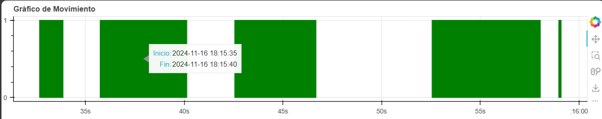

# Proyecto de Detección de Objetos en Tiempo Real

Este proyecto utiliza OpenCV para la detección de objetos en tiempo real a través de la cámara web. El sistema detecta cambios en la escena y registra los tiempos de inicio y fin en los que un objeto es detectado. Adicionalmente, incluye una funcionalidad para graficar los tiempos de detección utilizando Bokeh, lo que permite visualizar los intervalos de detección de movimiento. Este proyecto fue realizado con el propósito de practicar Python y las bibliotecas que utilicé.

## Descripción del proyecto

El código captura imágenes en tiempo real desde la cámara web y las procesa para detectar movimientos o cambios significativos en la escena. Cuando se detecta un objeto en movimiento, se guarda el tiempo de inicio y fin de la detección en un archivo CSV. El proyecto emplea técnicas de procesamiento de imágenes como la conversión a escala de grises, la difuminación gaussiana, y la detección de contornos para identificar y resaltar los objetos en movimiento. Además, genera un gráfico interactivo en formato HTML que muestra visualmente los intervalos de detección.

## Requisitos

Para ejecutar este proyecto, necesitas tener instaladas las siguientes librerías:

* ```OpenCV```: para el procesamiento de imágenes y la captura de video.
* ```Pandas```: para almacenar los tiempos de detección en un archivo CSV.
* ```Bokeh```: para graficar los intervalos de detección.

Puedes instalar las dependencias con:

    pip install opencv-python pandas bokeh

## Funcionamiento

El programa captura video desde la cámara web.
Convierte cada cuadro a escala de grises y aplica un desenfoque para reducir el ruido.
Calcula la diferencia entre el primer cuadro (cuadro de referencia) y los cuadros posteriores.
Detecta los contornos en las diferencias de las imágenes y resalta los objetos en movimiento con un rectángulo verde.
Cuando se detecta un objeto en movimiento, se registran los tiempos de inicio y fin de la detección.
Los tiempos de inicio y fin de cada detección se almacenan en un archivo ```Times.csv```.

## Archivos principales

* ```app.py```: Script principal que realiza la detección de movimiento y guarda los tiempos en un archivo CSV llamado ```Times.csv```.
* ```plotting.py```: Script para generar un gráfico interactivo de los tiempos de detección usando Bokeh. El resultado se guarda en un archivo ```Graph.html```.


## Funcionamiento

### Detección de Movimiento

1. El programa captura video desde la cámara web.
Convierte cada cuadro a escala de grises y aplica un desenfoque para reducir el ruido.
2. Calcula la diferencia entre el primer cuadro (cuadro de referencia) y los cuadros posteriores.
3. Detecta los contornos en las diferencias de las imágenes y resalta los objetos en movimiento con un rectángulo verde.
4. Cuando se detecta un objeto en movimiento, se registran los tiempos de inicio y fin de la detección en ```Times.csv```.

### Generación del Gráfico

1. El archivo ```plotting.py``` carga los tiempos registrados en ```Times.csv```.
2. Utiliza Bokeh para crear un gráfico de barras que muestra los intervalos de detección de movimiento.
3. El gráfico se guarda en un archivo interactivo HTML llamado ```Graph.html```.

## Uso

1. Ejecuta el script ```plotting.py``` en tu entorno local para iniciar la detección de movimiento y generar el gráfico.
2. La ventana de video mostrará cuatro vistas:
    * "Gray Frame": Imagen en escala de grises.
    * "Delta Frame": Diferencia entre el cuadro actual y el cuadro de referencia.
    * "Threshold Frame": Imagen binaria para detectar los cambios.
    * "Color Frame": Imagen con los contornos dibujados alrededor de los objetos detectados.
3. Cuando desees terminar la detección de movimiento, presiona la tecla ```q```. Esto detendrá el programa y generará automáticamente el archivo ```Graph.html``` con un gráfico interactivo de los intervalos de detección basado en los datos recopilados en ```Times.csv```.


## Resultados

1. Archivo ```Times.csv```: Contiene los tiempos de inicio y fin de las detecciones de movimiento en formato CSV, en el que cada fila contiene:

    * Inicio: El momento en que se detecta un objeto.
    * Fin: El momento en que el objeto deja de ser detectado.

    Ejemplo de un archivo CSV generado:
    
        Inicio,Fin
        2024-11-15 12:00:01,2024-11-15 12:00:05
        2024-11-15 12:02:15,2024-11-15 12:02:30

2. Archivo ```Graph.html```: Muestra un gráfico interactivo con los intervalos de detección, donde:
    * El eje X representa el tiempo.
    * El eje Y muestra los intervalos de detección (siempre con un valor fijo para simplificar la visualización).

## Ejemplo del Gráfico
El gráfico generado tiene la siguiente estructura:

* Las barras verdes representan los intervalos durante los cuales se detectó movimiento.

    
